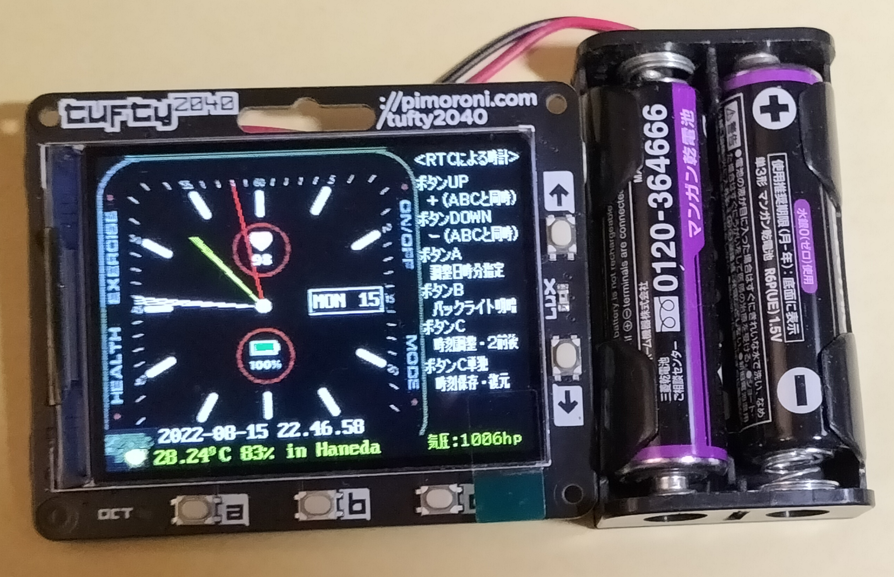

# GitPython
GPS watch for Raspberry Pi Pico written by MicroPython 
1) Use ST7789 IPS display 240x240 SPI 
2) Use GY-GPS6MV2 for real time clock 

#SPI(1) default pins 
spi1_sck   = 10 
spi1_mosi  = 11 
spi1_miso  =  8     #not use 
st7789_res = 12 
st7789_dc  = 13 
uart-tx    = 0 
uart-rx    = 1 

 

Pico-RTC watch on Tufty2040 (new_clock.py) 
1) Use SPI7789 + Tufty 2040 320x240 Parallel 
2) RGB565 can be selected when PicoGraphics's RGB332 is unavailable
3) Use WiFi for weather information (option) 
4) 2 Access Points auto roaming on WiFi  
 
